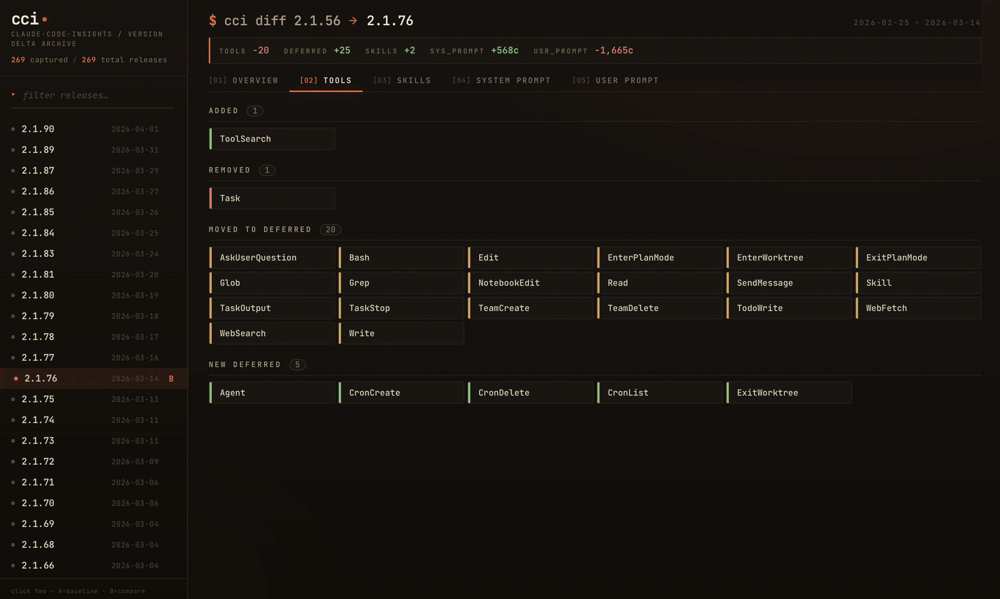
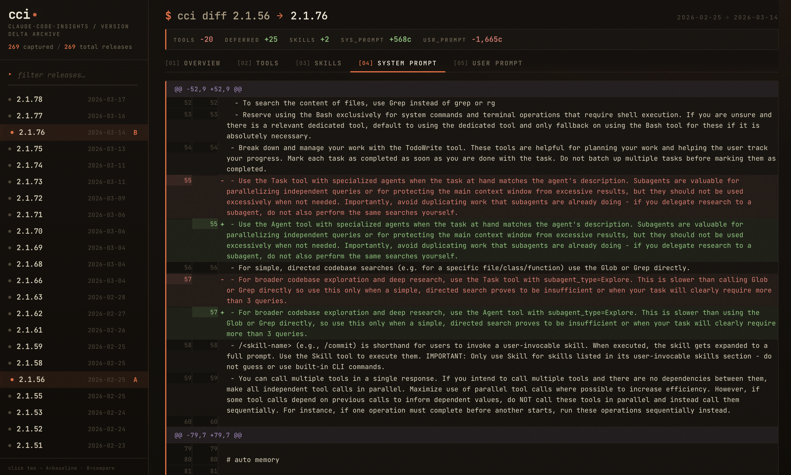

<div align="center">

# 🔬 Claude Code Insights

**The changelog Anthropic doesn't publish.**\
What actually changes inside Claude Code from one release to the next — system prompt, tools, skills, the hidden reminders it injects into your messages — captured and diffed, version by version.

*by [AgenticLoops.ai](https://agenticloops.ai) — for engineers, from engineers*

[](https://agenticloops.ai)
[](https://agenticloopsai.substack.com)
[](https://www.linkedin.com/company/agenticloops-ai)
[](https://x.com/agenticloops_ai)

### 🌐 [**Browse it live → agenticloops-ai.github.io/claude-code-insights**](https://agenticloops-ai.github.io/claude-code-insights/)

</div>

| | |
|---|---|
| [](https://agenticloops-ai.github.io/claude-code-insights/) | [](https://agenticloops-ai.github.io/claude-code-insights/) |

> **You don't need leaked source code to understand Claude Code.** The interesting part isn't the TypeScript — it's the **prompts and tool use**. Both travel over the wire on every request, in plaintext, on their way to `api.anthropic.com`. Pin a version, capture the traffic, diff against the next. That's the changelog Anthropic doesn't publish.
>
> New to *why* prompts and tool use matter? Read [**How agents work — the patterns behind**](https://open.substack.com/pub/agenticloopsai/p/how-agents-work-the-patterns-behind?r=1lm8w&utm_medium=ios) first. Then come back here for the receipts.

---

## 👋 Just want to browse?

You don't need to run anything. Everything is committed as plain text and Markdown. Pick a path:

### 🆕 Show me what's new in the latest release
→ Open the newest folder in [`versions/`](versions/) and click `diff-from-<previous>.md`. Start at the metric table at the top, then scan the section headers.

### 🔁 Compare any two versions
→ Use [`VERSIONS.md`](VERSIONS.md) — the full release index marks which versions are captured and links to each diff.

### 🧠 Just show me the system prompt for version X
→ [`versions/<release-date>_<version>/system-prompt.md`](versions/) — that's the exact text Claude Code sends on every request, with volatile bits scrubbed.

### 🛠️ What tools / skills does version X advertise?
→ Same folder: [`tools.json`](versions/), [`deferred-tools.json`](versions/), [`skills.json`](versions/).

### 🧰 I'd rather click than scroll Markdown
The web browser is hosted — no install needed:

→ **[agenticloops-ai.github.io/claude-code-insights](https://agenticloops-ai.github.io/claude-code-insights/)**

Or run either browser locally:

```bash
# Web — pick two versions in a sidebar, get a tabbed diff in the browser
( cd tools/web && npm install && npm run dev )      # http://localhost:5173

# CLI — scriptable + interactive (as-you-type filtering on `diff` with no args)
( cd tools/cli && npm install && npm run build && npm link )
cci versions
cci show 2.1.128
cci diff 2.0.45 2.1.128
```

See [`tools/README.md`](tools/README.md) for the full command reference.

### 💡 I want a 30-second story, not files
A few things you can already discover by reading the diffs:

> 🤖 [**The default model swapped six times in fourteen months**](VERSIONS.md) — sonnet-3-7 → opus-4 → opus-4-1 → sonnet-4-5 → opus-4-5 → opus-4-6 → opus-4-7.\
> 🪄 [**`ToolSearch` and lazy-loaded tools appeared in 2.1**](versions/2026-04-30_2.1.126/diff-from-2025-09-29_2.0.0.md) — `WebFetch`, `WebSearch`, `NotebookEdit`, `TodoWrite`, `ExitPlanMode` all moved from advertised to deferred.\
> 📈 [**The system prompt more than doubled at 2.1**](versions/2026-04-30_2.1.126/diff-from-2025-09-29_2.0.0.md) — 12,339 → 26,719 chars. Most of the new bytes are tone, planning, and "executing actions with care" sections.\
> 🛠️ [**16 new top-level tools at 2.1**](versions/2026-04-30_2.1.126/diff-from-2025-09-29_2.0.0.md) — `Agent`, `AskUserQuestion`, `CronCreate`, `Skill`, `ToolSearch`, `ScheduleWakeup`, `Monitor`, `RemoteTrigger`, `PushNotification`, and more. Built-in skills jumped from zero to ten.

---

## 📚 Reading guide

### What's captured for each version

For each pinned release, the repo contains the parts of Claude Code that travel on the wire — system prompt, tool catalog, skills, injected reminders, per-scenario stats — captured through an MITM proxy and committed as plain text so any two releases are one `git diff` apart.

| File in `versions/<v>/` | What it is |
|---|---|
| `system-prompt.md` | The exact instructions sent to the model on every request |
| `tools.json` | Every advertised tool with its full JSON schema |
| `deferred-tools.json` | Tools hidden behind `ToolSearch` (lazy-loaded, since 2.1.x) |
| `skills.json` | Skills surfaced in the "available skills" reminder |
| `user-prompt.md` | The `<system-reminder>` blocks Claude Code injects into your first message |
| `stats.md` | At-a-glance per-scenario summary table |
| `manifest.json` | Aggregate counts (tools, skills, tokens, durations, models) |
| `release-notes.md` | The upstream CHANGELOG entry for this version |
| `diff-from-<earlier>.md` | Markdown diff vs. the previous captured version |

### Anatomy of a diff file

`diff-from-<earlier>.md` follows a fixed template, so every version's delta reads the same way:

1. **Metric table** — net change in tool count, deferred-tool count, system-prompt size, reminder count, model.
2. **`## tools`** — added / removed / moved-to-deferred / moved-to-advertised / modified.
3. **`## skills`** — added / removed / description-changed.
4. **`## system prompt`** — unified diff of the system prompt.
5. **`## user prompt`** — unified diff of the injected `<system-reminder>` blocks.
6. **`## cli: 01-cli-help`** — added/removed CLI flags, with the full `claude --help` diff.

If a section is missing, nothing changed at that surface in this release.

### "Where do I look for…"

| Question | Look here |
|---|---|
| Did the default model change? | Metric table at the top of the diff, or `manifest.json → baseline.models` |
| Was a tool renamed or moved behind `ToolSearch`? | `## tools` in the diff |
| Did a tool description change? | `## tools → modified` in the diff; full text in `tools.json` |
| Did a built-in skill appear or change wording? | `## skills` in the diff; full descriptions in `skills.json` |
| Did the system prompt grow / shrink / reorder? | Metric table + `## system prompt` |
| Did Claude Code start injecting a new `<system-reminder>`? | `## user prompt` |
| Did a new CLI flag ship? | `## cli: 01-cli-help` |
| How does scenario X behave on this version? | `versions/<v>/scenarios/<NN>-<name>/stats.json` |

---

## 🎯 Who this is for

- **Engineers pinning Claude Code in production** — see what's about to change in the prompt that drives every response *before* you upgrade.
- **Prompt and tool-use authors** — Anthropic ships some of the best-tuned agent prompts in production. The diffs are a free apprenticeship in how a real shop iterates on tool descriptions, reminder phrasing, deferred-tool thresholds, and model routing.
- **Researchers** studying how agent surfaces evolve under real release pressure.
- **Anyone curious** about what *actually* changed when `claude --help` started listing a flag yesterday that wasn't there last week.

---

<details>
<summary><strong>🔬 How the captures are made</strong> (click for the technical pipeline)</summary>

All artifacts are captured using [**AgentLens**](https://github.com/agenticloops-ai/agentlens), an open-source MITM proxy that intercepts LLM API traffic during normal agent use, plus a thin Docker sandbox that pins one Claude Code version per image so captures are byte-comparable across hosts and months.

**The pipeline:**

1. **Pin** — `sandbox/Dockerfile` builds an image with one fixed `@anthropic-ai/claude-code` version plus `agentlens-proxy` and a deterministic fixture set (one demo MCP server, one fixture skill, a stripped settings file). No host `~/.claude`, no host MCP, no host git.
2. **Capture** — `scripts/capture-version.sh <version>` runs every scenario in a fresh container. AgentLens transparently records every request and response (system prompt, tool definitions, messages, token usage, timing) to `versions/<v>/scenarios/<s>/raw/`.
3. **Extract** — `scripts/extract.py` reads the AgentLens session JSON and writes the version-comparable artifacts. Volatile fingerprints (UUIDs, timestamps, cache-busters, the user email) are scrubbed so artifacts diff cleanly.
4. **Diff** — `scripts/diff-versions.py <from> <to>` produces the markdown report at `versions/<to>/diff-from-<from>.md`.

The whole pipeline is driven by a single slash command: `/process-version <version> [--diff-from <previous-version>]`.

### Sandbox isolation

- Every scenario runs in a fresh `docker run --rm` container; the `cch-auth` Docker volume is wiped of transient state at entrypoint (only OAuth credentials and the mitmproxy CA survive).
- The MCP server is sandbox-permanent: `sandbox/fixtures/mcp-default.json` (single `fixture` server, 3 tools) is merged into `~/.claude.json` on every container start. Account-level connectors don't bleed in.
- The fixture skill set under `sandbox/fixtures/skills/` is bind-mounted at `~/.claude/skills/` so skill discovery is deterministic.
- For older Claude versions that lack `--strict-mcp-config`, `sandbox/run.sh` probes `claude --help` and conditionally drops unsupported flags.

See [`sandbox/README.md`](sandbox/README.md) for the full auth model and layout.

### Scenarios

Five black-box probes, ordered so the always-runnable static probe comes first. Probes that exercise a feature introduced later carry a `min_version` and are skipped (not failed) on older releases:

| # | name | mode | min_version | what it probes |
|---|---|---|---|---|
| 01 | cli-help | local | — | top-level `claude --help` flag/command surface |
| 03 | bare | agent | — | baseline system prompt, default tools, default model |
| 04 | agent-task | agent | — | multi-turn loop with Write/Read/Bash + any haiku side-call pipeline |
| 05 | with-mcp | agent | — | MCP tool registration & naming convention |
| 06 | with-skill | agent | 2.0.28 | skill discovery via `<system-reminder>` and the `Skill` tool |

`02-bare` is the **baseline** — its extracted artifacts are mirrored to the version root. See [`scenarios/README.md`](scenarios/README.md) for the full schema.

</details>

<details>
<summary><strong>🚀 Run the pipeline yourself</strong> (click to expand)</summary>

Once-per-host setup (any version works to populate the `cch-auth` Docker volume):

```bash
./sandbox/login.sh <version>
```

Capture + extract + summarize + release-notes + diff for one version:

```bash
claude -p "/process-version <version> --diff-from <previous-version>"
```

Or call the primitives directly:

```bash
scripts/capture-version.sh <version>                         # all scenarios
scripts/run-scenario.sh    <version> <scenario>              # one scenario
python3 scripts/extract.py            versions/<dir>/scenarios/<scenario>
python3 scripts/summarize-version.py  <version>
python3 scripts/fetch-release-notes.py <version>
python3 scripts/diff-versions.py      <from-version> <to-version>
```

Refresh the version index:

```bash
claude /refresh-versions       # or: python3 scripts/refresh-versions.py
```

### Slash commands

Three slash commands live in `.claude/skills/`. They drive the pipeline — the LLM owns orchestration, the bash/Python scripts under `scripts/` are thin primitives the skills call via the Bash tool.

- **`/process-version <version> [--diff-from <previous-version>]`** — end-to-end orchestrator. Runs every scenario through the sandbox, extracts each capture, promotes the baseline, fetches the upstream release notes, and (optionally) writes a diff. Idempotent.
- **`/extract-capture <scenario-dir>`** — turn one raw AgentLens capture into the version-comparable artifacts. Used internally by `/process-version`.
- **`/diff-versions <from-version> <to-version>`** — generate a markdown diff between any two captured versions.

### Requirements

- Docker Desktop / Docker Engine
- Python 3 on the host
- A Claude subscription (logged in once via `sandbox/login.sh`)

</details>

<details>
<summary><strong>📂 Repository layout</strong></summary>

```
.
├── versions/              # captured artifacts, one folder per version  ← start here
├── VERSIONS.md            # generated index of every npm release
├── scenarios/             # one black-box probe per directory (prompt + meta)
├── sandbox/               # Docker image + entrypoint + run.sh + fixtures
├── scripts/               # capture / extract / summarize / diff / release-notes
├── tools/                 # CLI + web app for browsing the captures
└── .claude/skills/        # /process-version, /extract-capture, /diff-versions
```

</details>

---

## 🗺️ Coverage

The captured set spans the lowest and highest published version of each major (`0.x`, `1.x`, `2.x`), with newer 2.1.x releases captured more densely. Some scenarios fail on older versions because they exercise flags or models introduced later — those failures are visible per-scenario in `manifest.json` and are expected.

---

## ⚠️ Disclaimer

This repository is for **educational and research purposes only**. All trademarks belong to their respective owners. The goal is to understand and learn from this system, not to replicate it.

## 📜 Legal notice

This analysis was conducted through observation of network traffic during normal use of publicly available software. No security measures were bypassed, no proprietary source code was accessed, and no terms of service were violated beyond what is necessary for standard interoperability research. Captures are run inside an isolated Docker sandbox using a Claude subscription account; no other user's data is involved.

This is independent research and is not affiliated with, endorsed by, or connected to Anthropic.

## ⚖️ License

MIT
